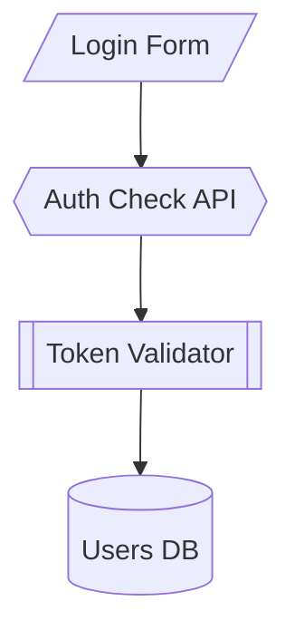

# KnowzCode

Your AI already knows how to code. **KnowzCode teaches it how to engineer.**

---

## Quick Start

**Get started in 3 steps:**

1. **Get the Template**
   ```bash
   # Option A: Clone from GitHub
   git clone https://github.com/AlexHeadscarf/KnowzCode.git
   cd KnowzCode

   # Option B: Download and extract knowzcode.zip
   unzip knowzcode.zip
   cd KnowzCode
   ```

2. **Install into Your Project**
   ```bash
   # Start Claude Code in this template folder
   # Then run the install command with your project path:
   /kc-install /path/to/your/project
   ```

3. **Start Building**
   ```bash
   # Switch to your project
   cd /path/to/your/project

   # Start your first feature
   /kc "Add user authentication"
   ```

That's it! KnowzCode guides you through spec → code → audit → commit.

---

## What is KnowzCode?

KnowzCode gives AI what every senior developer has: **permanent memory** and **system understanding**.

### The Problem with Traditional AI Coding

- **No memory** - AI forgets what it built between sessions
- **No context** - Changing one thing breaks others without warning
- **No structure** - Each feature built in isolation
- **No verification** - "Done" means "I wrote code", not "it works correctly"
- **No documentation** - Code and docs drift apart immediately

### How KnowzCode Solves This

| You Get | What It Means |
|---------|---------------|
| **🏷️ NodeIDs** | Every building block (UI_LoginForm, API_AuthCheck) has a permanent, unique identity that persists forever |
| **🗺️ Visual Architecture** | Mermaid diagram showing HOW everything connects - AI sees your system like an architect |
| **📋 Living Specs** | Detailed blueprints for each NodeID that evolve from planned → built → verified |
| **📊 Mission Control** | Real-time tracker showing what's done, in-progress, and blocked |
| **📖 Perfect Memory** | Complete history of what was built, why decisions were made, what problems were found |
| **🔍 Change Sets** | AI identifies ALL affected pieces before changing anything - no surprise breakage |
| **✅ Quality Gates** | Specs verified before coding, implementation audited after - no incomplete "done" |

---

## Installation

### Understanding the Template Model

**This repository is a TEMPLATE**, not a project workspace:
- ✅ Clone/download it ONCE
- ✅ Use it to install KnowzCode into MULTIPLE projects
- ✅ Keep it updated to get latest improvements
- ❌ Don't develop your actual projects here

### Step-by-Step Installation

#### 1. Get the Template

**Option A: Clone from GitHub**
```bash
git clone https://github.com/AlexHeadscarf/KnowzCode.git
cd KnowzCode
```

**Option B: Download ZIP**
```bash
# Download knowzcode.zip
unzip knowzcode.zip
cd KnowzCode
```

#### 2. Install into Your Project

**For a NEW project:**
```bash
# From the KnowzCode template directory
# Start Claude Code, then run:
/kc-install /path/to/your/new/project
```

**For an EXISTING project with KnowzCode:**
```bash
# Update to latest version
/kc-update /path/to/your/existing/project
```

#### 3. What Gets Installed

```
your-project/
├── .claude/                      # Claude Code automation
│   ├── commands/                 # 8 slash commands (/kc, /kc-step, etc.)
│   └── agents/                   # 15+ specialized AI agents
│
└── knowzcode/                    # KnowzCode framework
    ├── knowzcode_project.md      # Project overview & standards
    ├── knowzcode_architecture.md # Visual system map (Mermaid)
    ├── knowzcode_tracker.md      # Mission control dashboard
    ├── knowzcode_log.md          # Complete history & decisions
    ├── knowzcode_loop.md         # Workflow guide for AI
    ├── environment_context.md    # Your environment commands
    ├── specs/                    # NodeID blueprints
    ├── prompts/                  # 20+ workflow prompts
    ├── planning/                 # Planning documents
    └── workgroups/               # Active work tracking
```

**What you get:**
- ✅ 8 slash commands for workflows
- ✅ 20+ automation prompts
- ✅ 15+ specialized AI agents
- ✅ Complete quality enforcement system
- ✅ Multi-session collaboration support

#### 4. Verify Installation

```bash
cd /path/to/your/project

# Check that files were created
ls -la knowzcode/
ls -la .claude/commands/

# Test a command (should show usage help)
/kc
```

---

## Core Advantages

### 1. Permanent Identity for Every Building Block

**Traditional AI:**
```
You: "Update the login"
AI: "Which login? The form? The API? The validation?"
```

**With KnowzCode:**
```
You: "Update API_AuthCheck"
AI: "Found it. This affects UI_LoginForm above and SVC_TokenValidator below."
```

Every piece of your system gets a **NodeID** - a permanent, unique name that persists across all sessions forever.

### 2. Visual System Understanding

NodeIDs aren't just labels - they live in a **Mermaid diagram** showing:
- WHERE each piece fits
- HOW it connects to others
- WHAT depends on it



The AI sees your system spatially, like an architect reading blueprints.

### 3. Complete Change Sets

**Traditional AI:** Changes one thing, breaks three others

**KnowzCode:**
```
You: "Add password reset"
AI: "This Change Set requires:
     - NEW: UI_ResetForm, API_ResetPassword, SVC_EmailService
     - MODIFY: UI_LoginPage (add forgot link)
     - MODIFY: DB_Users (add reset_token column)
     All 5 NodeIDs will be built together."
```

No partial implementations. No surprise breakage.

### 4. Living Documentation

Each NodeID has a detailed spec file (`knowzcode/specs/NodeID.md`) containing:
- Purpose and responsibilities
- Dependencies and interfaces
- Core logic and behavior
- Verification criteria
- Technical debt notes

**Specs evolve:** Planned → Implemented → Verified → "As-Built"

Unlike traditional docs, specs are updated AFTER building to match reality.

### 5. Mission Control Dashboard

See everything at a glance in `knowzcode_tracker.md`:

| Status | WorkGroupID | NodeID | Label | Dependencies |
|:---|:---|:---|:---|:---|
| 🟢 VERIFIED | - | UI_LoginForm | Login Form | - |
| ◆ WIP | kc-feat-143022 | API_AuthCheck | Auth API | UI_LoginForm |
| ⚪️ TODO | - | API_PasswordReset | Reset API | API_AuthCheck |

Track progress, spot blockers, understand dependencies.

### 6. Perfect Historical Memory

`knowzcode_log.md` records:
- What was built and when
- Why decisions were made
- What problems were discovered
- What technical debt was created

**Example:**
```
You: "Why does this auth code look weird?"
AI: "Per log entry Jan 15, we worked around a third-party
     API limitation. See WorkGroup kc-fix-20250115-143000."
```

### 7. Built-in Quality Gates

**Before coding** (Spec Verification):
- For large changes (≥10 NodeIDs), specs are audited for completeness
- Prevents building on a flawed foundation

**After coding** (Implementation Audit):
- READ-ONLY comparison of code vs specs
- Reports true completion percentage: "85% of requirements met"
- Prevents incomplete "done" claims

### 8. Multi-Session Collaboration

Work on multiple features simultaneously without conflicts:

```bash
# Developer 1
git checkout -b feature/profiles
/kc "Add user profiles"

# Developer 2
git checkout -b feature/notifications
/kc "Add email notifications"

# Merge both - conflicts auto-resolve
git merge feature/profiles     # ✓ Clean
git merge feature/notifications # Conflict (expected)
/kc-resolve-merge              # Auto-resolves safely
```

See [`MULTI_SESSION.md`](MULTI_SESSION.md) for patterns and best practices.

---

## How It Works: The KnowzCode Loop

Every feature follows this verification-driven process:

### **Loop 1A: Impact Analysis**
```bash
/kc "Add password reset feature"
```

AI identifies the complete Change Set:
- What NodeIDs need to be created
- What existing NodeIDs need modification
- What dependencies exist
- Visual impact on architecture

### **Loop 1B: Draft Specs**

AI creates detailed blueprints for each affected NodeID:
- Purpose and interfaces
- Core logic and data structures
- Error handling and edge cases
- Verification criteria

**For large changes (≥10 NodeIDs):** Spec Verification Checkpoint runs automatically

### **Loop 2A: Implement Change Set**

AI builds ALL NodeIDs in the Change Set together:
- Writes code following your standards
- Runs tests and linters
- Performs initial verification

### **Loop 2B: Verify Implementation**

READ-ONLY audit compares code against specs:
- Calculates true completion percentage
- Identifies gaps and missing requirements
- Reports what's actually done vs claimed

### **Loop 3: Finalize & Commit**

- Updates all specs to "as-built" state
- Logs decisions and discoveries
- Schedules technical debt (REFACTOR_ tasks)
- Creates clean git commit
- Updates tracker to VERIFIED

---

## Real World Example

### Traditional AI Coding

```
Monday: "Add user profile"
→ AI writes some profile code

Wednesday: "Add user settings"
→ AI writes settings code (doesn't connect to profile)

Friday: "Make profile show settings"
→ AI: "I don't see how these relate..."
```

### With KnowzCode

```
Monday: /kc "Add user profile"
→ AI: "Creating NodeIDs: UI_UserProfile, API_GetProfile
       Updating: UI_Navigation (profile link)
       All connected in architecture diagram"

Wednesday: /kc "Add user settings"
→ AI: "I see UI_UserProfile exists from Jan 7.
       Creating: UI_UserSettings (child component)
       Creating: API_UpdateSettings
       Linking to existing profile NodeID"

Friday: "Make profile show settings"
→ AI: "Both exist in architecture. Already connected.
       One-line change to UI_UserProfile render.
       Change Set: 1 NodeID modified"
```

---

## Key Workflows

### Starting a New Feature

```bash
/kc "Your feature description"
```

Executes the complete loop: analyze → spec → build → verify → commit

### Continuing Active Work

```bash
/kc-step 2A  # Jump to implementation
/kc-step 3   # Jump to finalization
```

### Running Audits

```bash
/kc-audit spec          # Verify all specs are complete
/kc-audit architecture  # Check architecture health
/kc-audit security      # Run security review
/kc-audit integration   # Holistic system audit
```

### Quick Fixes

```bash
/kc-microfix src/auth.ts "Fix null check in validation"
```

For small changes (<50 lines, no ripple effects)

### Planning

```bash
/kc-plan feature   # Break down a major feature
/kc-plan refactor  # Plan refactoring work
```

### Resolving Merge Conflicts

```bash
git merge feature/notifications  # Conflict occurs
/kc-resolve-merge               # Auto-resolves tracker/log
git commit -m "Merge features"
```

---

## Documentation

- **[Getting Started](./docs/knowzcode_getting_started.md)** - Complete walkthrough and first steps
- **[Understanding KnowzCode](./docs/understanding-knowzcode.md)** - Deep dive into concepts
- **[Prompts Guide](./docs/knowzcode_prompts_guide.md)** - All commands and workflows
- **[Visual Guide](./docs/knowzcode_guide.md)** - File structure roadmap
- **[Multi-Session Guide](./MULTI_SESSION.md)** - Team collaboration patterns
- **[Installation Guide](./INSTALL.md)** - Detailed setup and troubleshooting

---

## Comparison Table

| Aspect | Traditional AI Coding | KnowzCode |
|--------|----------------------|-----------|
| **Memory** | Forgets between sessions | Permanent NodeID identity + complete log |
| **Context** | Reads entire codebase or misses connections | Visual architecture shows exact relationships |
| **Changes** | Modifies random files → breaks things | Complete Change Sets → all affected pieces together |
| **Updates** | "Update the auth" → "Which auth?" | "Update API_AuthCheck" → knows exactly what |
| **Verification** | "Done" = "I wrote code" | ARC Verification = tests pass, meets quality gates |
| **Documentation** | Drifts from reality immediately | Specs updated to "as-built" after every change |
| **Collaboration** | Merge conflicts everywhere | Git branches + `/kc-resolve-merge` = clean merges |
| **Quality** | Hope tests catch issues | Pre-code spec audit + post-code implementation audit |
| **Tech Debt** | Accumulates invisibly | Every debt logged → REFACTOR_ tasks auto-scheduled |
| **System View** | Flat file list | Visual architecture diagram |

---

## Prerequisites

- **Claude Code** (or any AI assistant that can read/write files)
- **Git** (for version control)
- **Basic familiarity** with AI-assisted coding
- **A project** (new or existing)

---

## Updating KnowzCode

Keep your projects up-to-date with the latest improvements:

```bash
# From the KnowzCode template directory
/kc-update /path/to/your/project
```

**The update safely:**
- ✅ Preserves your project data (tracker, logs, specs)
- ✅ Updates framework files (prompts, loop, commands)
- ✅ Protects your customizations (creates `.new` files for review)
- ✅ Validates update succeeded

---

## Critical Concepts

### Environment Context

The AI needs `knowzcode/environment_context.md` configured for YOUR setup:
- Package manager (npm vs yarn vs pnpm)
- Python version (python vs python3)
- Test commands
- Database connection
- Build process

This teaches the AI to work in YOUR environment.

### WorkGroups

Each feature gets a unique **WorkGroupID** (e.g., `kc-feat-20250109-143022`):
- Groups related NodeID changes together
- Tracks progress as a unit
- Creates clean git history
- Enables multi-session collaboration

### ARC Verification

**A**ttentive **R**eview & **C**ompliance ensures quality:
- All tests pass
- Security standards met
- Performance acceptable
- Error handling robust
- Documentation accurate

Every NodeID must pass ARC before marking VERIFIED.

---

## Acknowledgments

KnowzCode is built upon the excellent foundation of the [Noderr project](https://github.com/kaithoughtarchitect/noderr) by [@kaithoughtarchitect](https://github.com/kaithoughtarchitect). We're grateful for their pioneering work in systematic AI-driven development.

---

## License

MIT License - Use freely in your projects

---

## The Bottom Line

**Traditional AI coding** = Eager intern who writes random code

**KnowzCode** = Disciplined engineer who:
- ✅ Understands your entire system
- ✅ Sees how changes ripple through architecture
- ✅ Follows your quality standards
- ✅ Documents what was actually built
- ✅ Remembers everything forever
- ✅ Works cleanly with your team

---

## Questions?

- **"Do I install KnowzCode into this template repo?"** - No! Clone/download the template, then install INTO your actual projects.
- **"Can multiple people use KnowzCode on the same project?"** - Yes! See [MULTI_SESSION.md](MULTI_SESSION.md) for collaboration patterns.
- **"What if I already have a large codebase?"** - Use the retrofit workflow to map existing code to NodeIDs.
- **"Does this work with any AI?"** - Yes, but optimized for Claude Code. Works with ChatGPT, Cursor, or any file-based AI assistant.

---

*Welcome to systematic AI development. Welcome to KnowzCode.*

**Because great software isn't just coded. It's engineered.**
